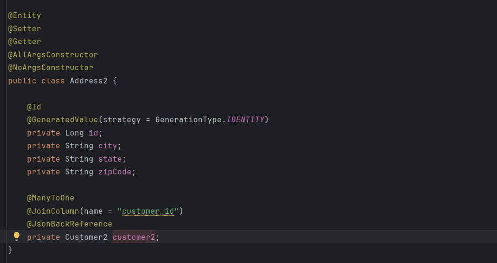
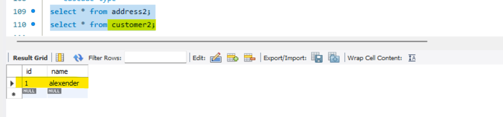
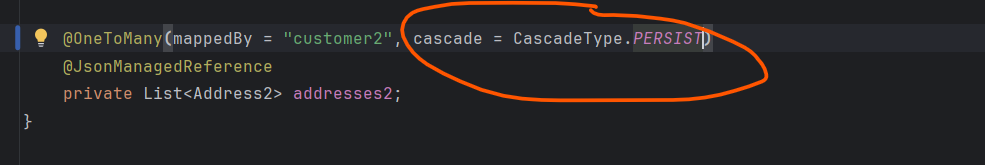

# CascadeType

    In JPA Cascade define how Child entity should behave when you perform any operations on Parent Entity.

    Customer entity having ont to many mapping with Address Entity

   
   
   
   
    From address It is many to one which is bi-directional
    Customer has many child which is list of addresses.

    Now what cascade will define here when you save the customer object do you want to save child along with customer or when you
    are updating a customer do you want this child to be update or if you are deleting a customer do you want this child to be 
    deleted. any action you are performing on parent entity do you want that changes to reflected on child entity or not.
    that is what something define by the cascade type. 

   
   
   

 # If we are not defined any CascadeType How the System will Behave

    let's try to save customer along with address.

   
   
   
   
   we can see only insert statement for a customer we can not see any insert statement for a child entity address.
    even we can verify in our database as well.
   
   
   
    we have not defined any cascade type which mean when i am persisting the parent along with a child it will not 
    reflect the child changes. it will only persist into the parent record not into the child record.
    so, To avoid this kind of scenario we can go with CascadeType = PERSIST.

 # CascadeType : PERSIST

   # Use Case - 1   (for save)  it will save in both parent and child

    If you want to save parent along with the child then you must need to define CascadeType = PERSIST, 
    otherwise it will only save the parent and it will skip the child. 

   
   
   
   
   

    we can see along with a customer it persist the child Address entity as well. that's the reason the cascade
    type itself called PERSIST.

   # Use Case - 2   (for update) In case of update it will update only for parent and child not get update

    if you see here we have not used the merge cascade type still we are using cascadeType = PERSIST
    now let's try to update Parent along with the Child in a Request and we will see whether the child 
    record is getting updated or not if not then we will see it's solution.
    let's try to update the parent entity customer name and child entity address zipcode and see either
    both parent and child entity is getting updated in our database or not

   
   
   
   

    So, In case CascadeType.PERSIST only the Parent Entity got updated child entity not get updated
    so, How we can tell to JPA we want to update Parent and Child both Entity to get updated how we can tell by 
    using cascadeType.MERGE.

# CascadeType : MERGE   (we will validate update scenario parent along with child)

    When you are updating the Parent Entity along with the Child, Do you want to reflect the update on child or not.
    Persist talked about the save operation and merge will talked about the update operation.

   
   
   
   
   
    so we can see Parent and child both are got updated in case of Cascade Type MERGE.
    if you validate in console there are 2 update one for parent customer and one for child address.

 # CascadeType : REMOVE (If I will delete a Customer does it delete a Child Address or not let's validate)

  # Use Case 1 : without Cascade Type.REMOVE

    I have not defined any REMOVE cascade type as of now
   

    let me try without REMOVE cascade type
   
   
   
   

    I am trying to delete the parent and i am expecting it should also delete the associate child as well
    But it is simply deleting the Parent entity Customer in a console query 
    since we have the mapping so we are getting constraint violation error that is expected behind the scene what JPA trying to delete
    he is only trying to delete the parent because we have not informed to the JPA If i will perform delete operation on the parent 
    you also delete the associate child we can define by
    CascadeType.REMOVE.

 # Use Case 2 : with Cascade Type.REMOVE

   
   
    let's restart app and try delete parent entity with id 1 and verify either its deleting the associate entity as well or only parent.

   
   
   
   

    so we can see the record got deleted from the associated entity as well while we are deleting from the parent entity.

  -> Let's discuss about the REFRESH and DETACH

# CascadeType : REFRESH

    when we should go for REFRESH, when you are refreshing your parent entity along with that you want also to reflect or refresh 
    the child in-memory changes or address in memory changes.

   

    let's say i will load the customer and at the same time in the In Memory I am modifying something on the address
    whether it should reflect the change or not let's play with REFRESH cascadeType.

    let's see our db record first
   
   

    Mostly you can play with It using PersistentContext and @Transactional.
    
   
   
   
    for refresh scenario we have define a method with transactional 
    I am reloading the original city from DB for the address and printing it.
    Forcefully we are changing the city name which is nothing my Inmemory changes 
    Now after refresh customer parent entity (emtityManger.refresh(customer)) we need to validate 
    whether the child changes address is getting reflected or not.
    so let's update the db and change address to HYD

   
   
    now from db it will fetch HYD
    then in memory am chnaging it to New City
    then we need to validate after Refresh the Child changes are reflecting or not either showing HYD or New City.

   
   

    we are expecting to refresh the child changes but it's not doing it.

    If you want Your Parent to REFRESH with your child then you should go for CascadeType.REFRESH

   

   # use case 1  

    in db we have updated to HYD for id 6 under customer id 2

   

   but we are changing it to NewCity in our In Memory and then refreshing Parent Entity then we can see the HYD Changes Reflecting to console
    for Child Entity

   
   

  # use case 2
   
    lets change to DEL in db and hit refresh

   

   

   

    since we are defining cascadeType as REFRESH when i am asking EntityManager to REFRESH the data it also refresh the child changes.
    
    
    
   # CascadeType : REFRESH

   

    I am loading the customer from db and i am loading the address

    then validating Before Detach and After Detach

    Before Using before detach when you detach the customer does It hold the address and 
     then after detach when you retriving a customer does it hold the address or not
 
   

   detach is not something deleted when you are detaching you are detaching that entity from the Context not from the database
    as og now we have not used detach cascade type.
    when you will detach the parent you will get the result below true

   

    17:40
    
