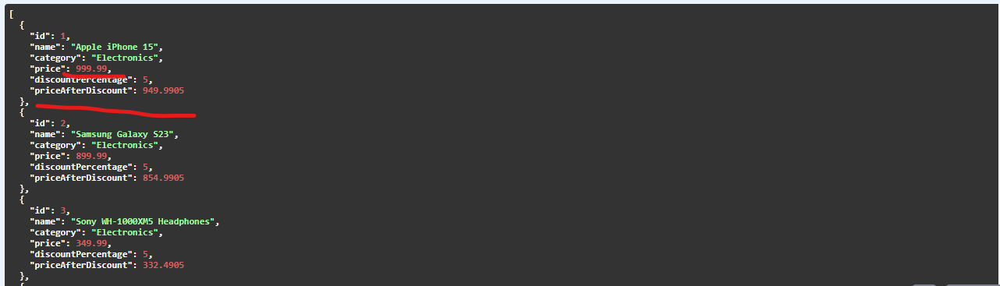

 # @Formula | Dynamically Compute Derived Fields 
 
    The Attribute in an Entity which annotate with @Formula consider this attribute as a Transient attribute 
    and based on the expression what you defined on top of that annotation will evaluate as a SQL expression
    on the fly. because of transient attribute this field is not going to be save in our table.

    we can use this @Formula annotation to evaluate any aggregate function on the fly.
    suppose you have a date of birth and you want to evaluate the age of the person 

    The @Formula annotation in Hibernate allows you to map a computed value or SQL expression to a field in 
    your entity class. This field is not persisted in the database but is computed at runtime based on the SQL 
    expression provided in the @Formula annotation.

 traditional and formula way response is like 
   
 
In a traditional way we have created a Mapper class (ProductResponseMapper) what it will do is it will fetch product
entity details from db as a list and convert it to ProductResponse where we are having one newly added field priceAfterDiscount
and then sending as a Product Response.

In a Formula way In our Product Entity we are having a field priceAfterDiscount which is annotated with @Formula which
hibernate will treat as a transient attribute so it will not persist into database and on the fly it will do computation 
apply formula on that particular attribute and while controller sending response back it will reflect as a response.
    
   