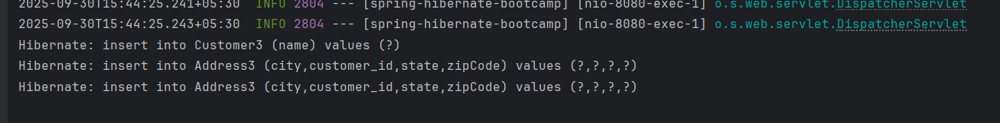
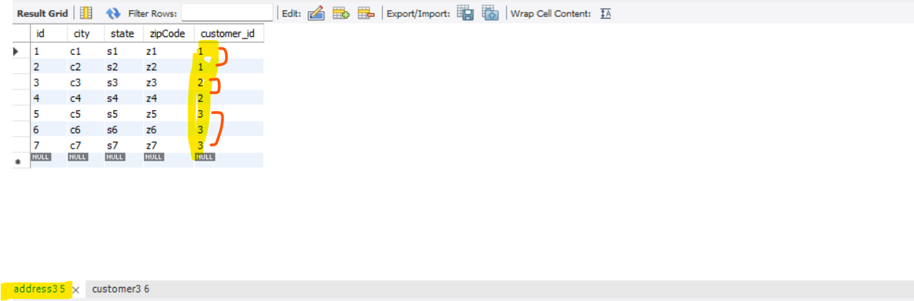

 # N+1 Problem and their Solution

   # N+1 Problems

    Imagine you have a list of customers customer 1, customer 2, customer 3.
    Each Customer associated with a different diffenet Addresses.
    c1 associate with a1 and a2
    c2 associate with a3 and a4
    c3 associate with a5
    
    so, here one customer mapped to many addresses. so, It can be one-to-many mapping.

   

    now suppose you need to get all the customers along with their addresses. If your application is not optimised what it does

    - It will first execute a single Query to get all the customers. so we have 3 customers now.
    - For Each customers it will fetch their addresses one by one.
    - since we do have 3 customer it will execute 3 different query.
    - If you see total how many no. of Query get executed to load all customers along with their addresses.

   

    - First Query to fetch all the customers.
    - Since we have total no. of customers 3 so, we execute 3 diff query to fetch address based on the customer c1, c2 and c3.
    - So, The Total Query Count = 4, which can downgrade your application performance. 
   

    - To load all the customers along with their addresses instead of this we can follow another approach either using JOIN Query
    - We can follow some another approach instead of hitting database 4 times.
    - This is what called N+1 problem.
    

 # WHy the Name is Like (N+1) Problem

    If you observed the Number of Queries its execute.
    1st Query to load the Parent Entity which mean all the customers.
    We have total of 3 customers.
    Rest 3 Query to get the addresses for an individual customers.
    which is nothing N so (3+1) i.e (N+1)
    
    one is the initial query to load all customers and the total number of customers n so, for each customer it will execute another
    query to load the dependent object which is nothing address.
    thats what its called n+1 problem.
    
    so if we have 100 customers it will load 101 times, 1 time to load all customers and 100 times for each individual customer to get addresses.
    so hitting databases multiple times it will downgrade your application for sure.
    

# Resolution for (N + 1) Problem

 # Solution 1 - Using @EntityGraph annotation (Recommended Solution)

    let's see how we can resolve this n+1 problem. 
    let's see How we can load all customers along with there respective addresses with a single Query.
    we can see it's using left join query to fetch the all parent along with its dependent entity details.
    no. of query executed - 1
    no. of times hitting to the database - 1
    doesn't matter how many no. of customers you do have.
    it will just use the join queru based on common field customer id in both of the tables.

# Solution 2 - Using JOIN FETCH (our own Implementation)

    If you don't want to use @EntityGraph annotation and you want to provide your our own implementation you can do that as well.
    We can create and use our own custom JOIN Query in stead of @EntityGraph using join query.
    
    In a Customer3Repository we can define a method named with fetchCustomersWithAddresses.
    
   

    Hibernate: select c1_0.id,a1_0.customer_id,a1_0.id,a1_0.city,a1_0.state,a1_0.zipCode,c1_0.name from Customer3 c1_0 left join 
    Address3 a1_0 on c1_0.id=a1_0.customer_id

   

    we can see in both of the cases the single left join query executed to fetch all the customers details along with their associated
    addresses.
    
    In This ways we can resolve N + 1 Problems.

