# Loading Strategies

    we do have 2 loading strategies. 
    If you Observed Library having @OneToMany mapping to the Books. 
    If you check the Book It says Bi-Directional Mapping.
    Book also having map to Library with @ManyToOne.
    
 -> Our main focus will be how lazy and eager internally works- 

 -> By Default, fetching strategy will be LAZY loading.

   # Lazy (By Default)
    
    when i say lazy loading who is the parent here library and who is the related or child entities book.
    lazy means don't fetch the related entities unless i asked to you.
    when you load the library hibernate will not load books immediately.
    If you are using lazy loading when you load the library, books value will not be loaded immediately untill and unless
    explicitely you informed to the jpa or hibernate while loading the library i want to get books as well then hibernate 
    will fire an another query to get a books. 

    Lazy loading means load only the parent entity and don't load all it's related entities. 

   # Eager

    Eager means fetch related entities as well while you were loading parent entity.
    while i am loading the library currently related entity is books so while loading the library load books as well.
    In Eager Laoding case when you fetch a library the books will be fetch immediately in the same query using join or fetch query.
    

   Remember, you can go for lazy loading when you don't want to load all the related entities.
              you can go for eager loading when you want to load everything.

   # Debugging  -

   # Lazy Loading - Debugging

    we will give the customer id it will return the Customer, it would be optional if you not give fetchType it would be LAZY bydefault.
   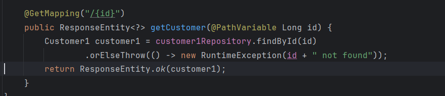
   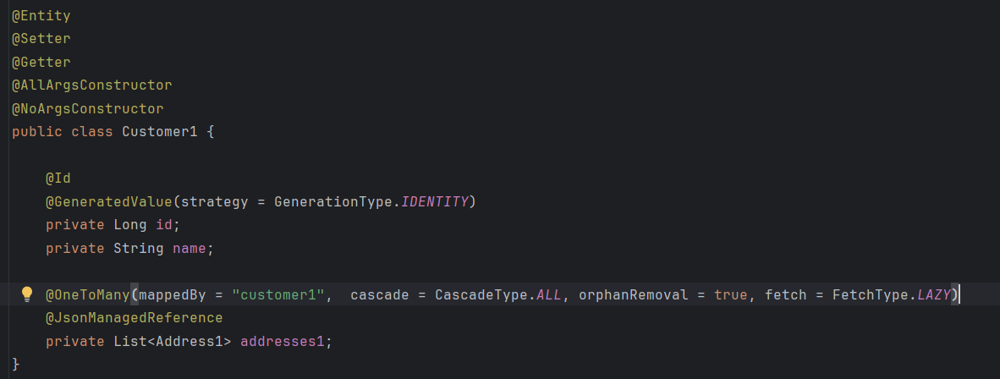

    usecase - 
        In Lazy loading Does Hibernate or JPA Trigger a Single Query to Load a Parent Entity and when I will ask for address child
        entity means based on demand it will fire the another Query let's do validate that.
        and later we will validate for a Eager loading jpa/hibernate fire a JOIN query to load everything in one go we will validate that as well.

   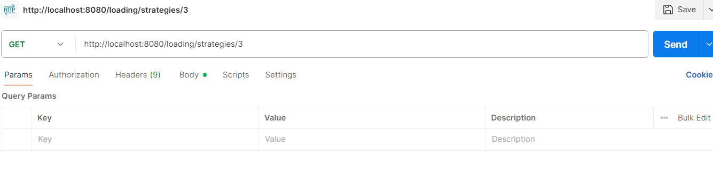
   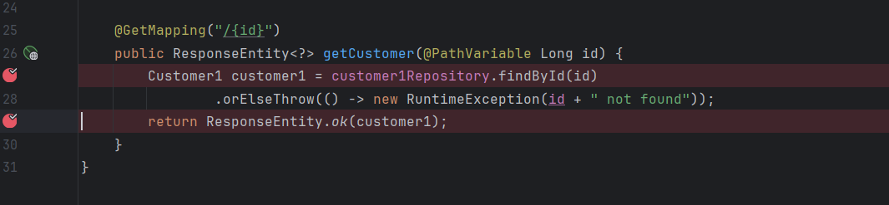
   
    This is where exactly your app will connect to db.
   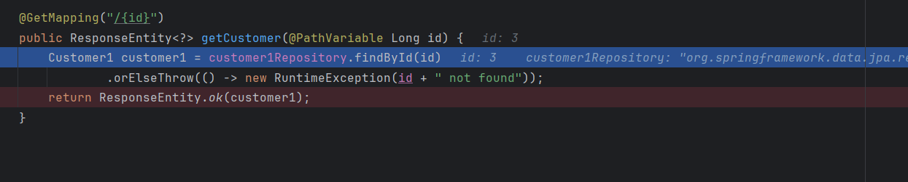

    If you can see since I have defined the lazy loading it first execute to laod my parent entity that is customer now it
    did not trigger the address query because I did not ask jpa/hibernate to give the address along with this customer.
    now If I ask it will fire another query based on user demand lets validate.
   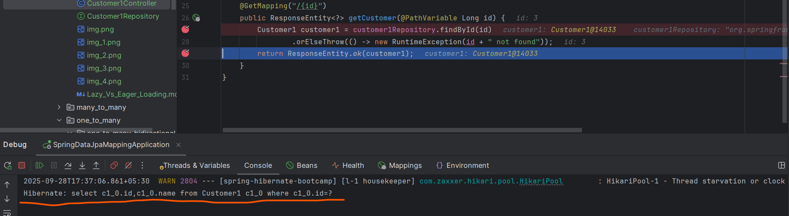
    
    If I ask it will fire another query based on user demand lets validate.
   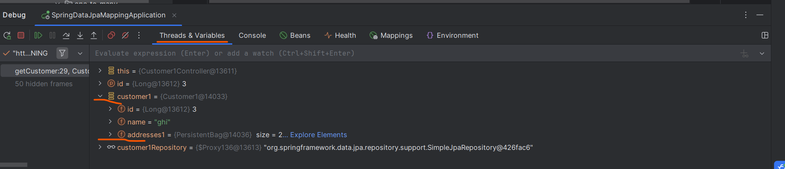
   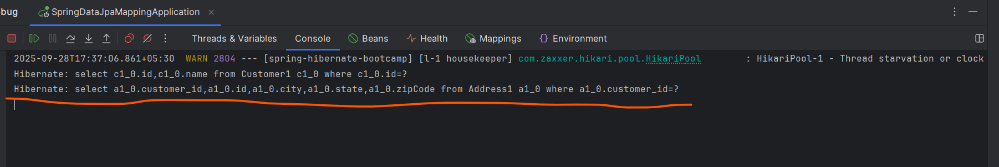
   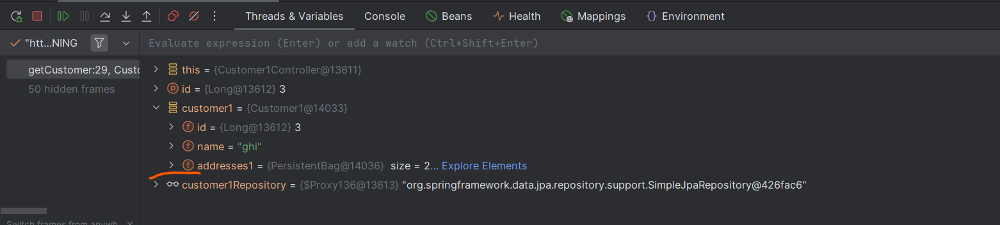
   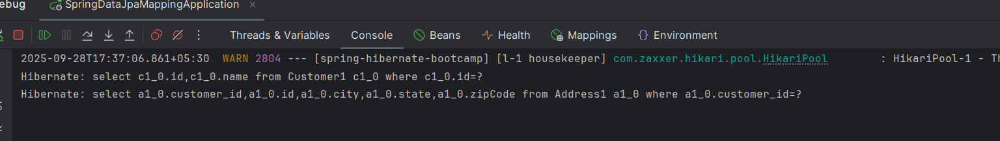

    In Lazy Loading it will only load the parent entity and it will load only the related entities when only you will ask to load.
    so, explicitely we ask to get address from customer then 2nd query get triggered thats the behavior of Lazy loading.

   # Eager Loading Debugging
    
   
   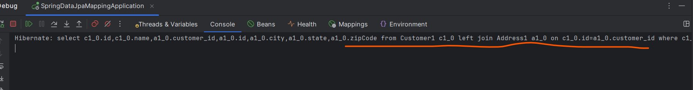

    when i define the fetching strategy as a EAGER and when we are asking only to load a customer object it is executing a JOIN query.
    It does not matter whether you are asking to load or fetch dependent entites it will load all entities uisng JOIN query in case of EAGER.
    
 -> This is the key difference between EAGER and LAZY loading 
        In case of Lazy loading it will fetch only the parent entity until and unless you will ask to load the dependent entity
        But In case of EAGER Loading it will load everything all dependent entity and execute a JOIN Query to fetch.

   while we are fetching only the customer name and using Eager Loading then also it will execute JOIN query

 # lazy loading   -   customer ( 1 Query )

 # eager loading  -   customer+address (JOIN)

 Usecase 2

    In case of Lazy Loading If you ask to load address as well then it's going to fire 2 Query let's validate

   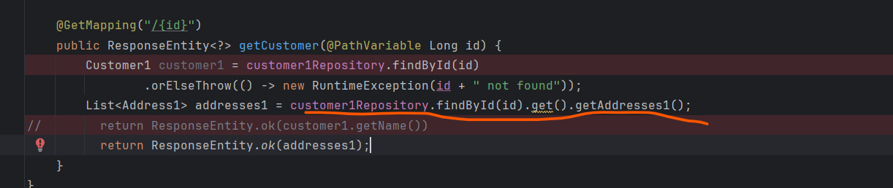
   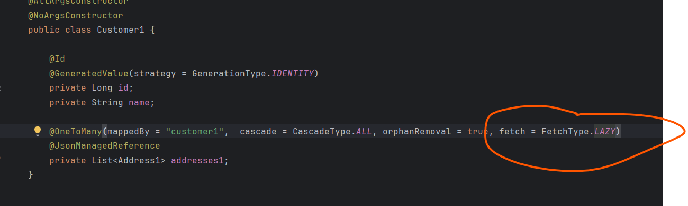

   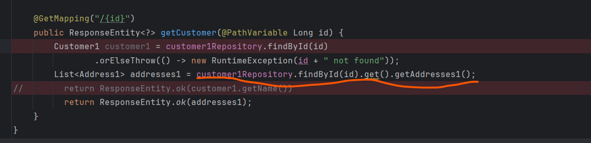
   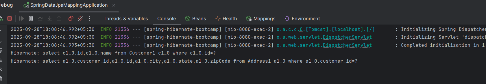

# Conclusion

1. While we are using LAZY loading and trying to get Customer Object it fire a Single Query.
2. While we are using LAZY loading and trying to get Address Object it fire 2 Queries 1 for Customer and 1 for Address.
3. While we are using LAZY loading and trying to get Customer name it fire a Single Query.

1. While we are using EAGER loading and trying to get Customer Object it fire a JOIN Query with customer and address.
2. While we are using EAGER loading and trying to get Address Object it fire JOIN Query.
3. While we are using EAGER loading and trying to get Customer name it fire JOIN Query.
    
    