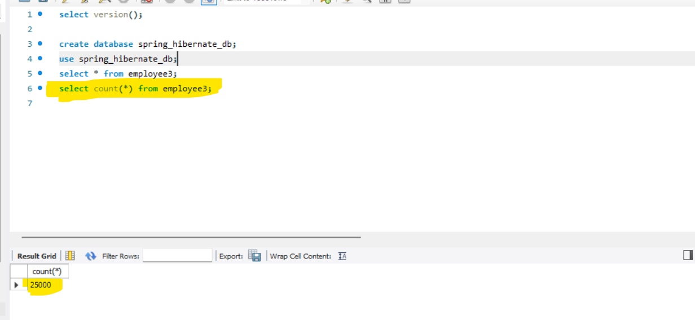
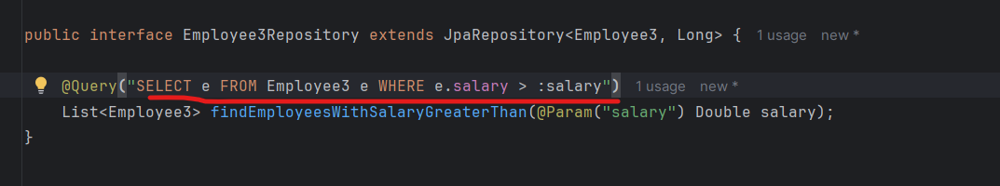
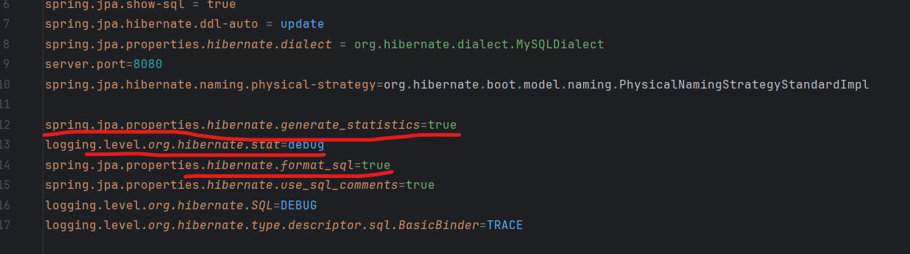
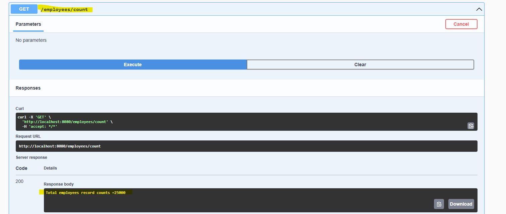
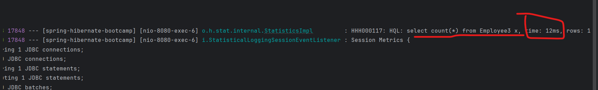
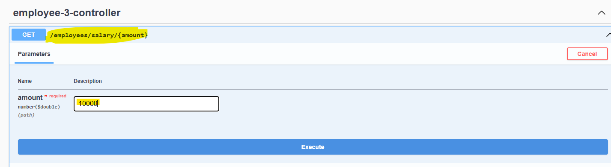
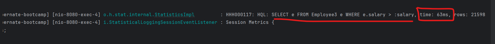
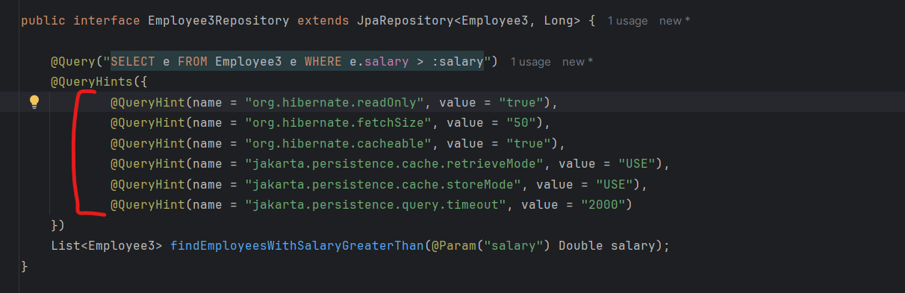
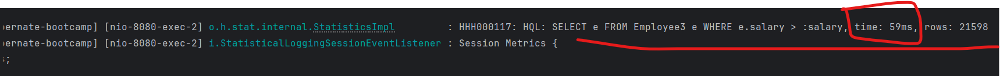

# Performance Comparison

    we have a total no. of 25k records

   

 # Without Query Hints

   

   
   
   
   
   
   
   
   
   
   
   
   

   # With Query Hints

   
   
   

   # Explanation-

   @QueryHints you have to use based on your use cases.

   @QueryHint(name = "org.hibernate.readOnly", value = "true")
   
    By defining this Query Hints I am telling to the Hibernate please execute the Query more in a READ only mode 
    which will enhance the performance by avoiding unnecessary state check. so do not do state check just execute
    this query as a READ only.

   @QueryHint(name = "org.hibernate.fetchSize", value = "50")

    Suppose I want to enable the fetch mode, i do not want to load all 25k records to load at a time. I will tell 
    hibernate to load it in a chunks or load it in a batch. it will improve performance and reduce the memory
    consumption.

   @QueryHint(name = "org.hibernate.cacheable", value = "true")
   
    you can tell to the hibernate to cache your Query Results. so it will store your all the search and query results
    to the hibernate second level cache. in this way we can avoid to hit db multiple times. 

   @QueryHint(name = "jakarta.persistence.cache.retrieveMode", value = "USE")
    
    Also, you can tell to the Hibernate to use the cache or to use the Query Cache where he has stored the Results.
    this indicate cache should be consulted when retrieving Entity and Query Results. you have enabled the cache but 
    you have to informed to the query hints to use the cache where we stored the query results. 

   @QueryHint(name = "jakarta.persistence.cache.storeMode", value = "USE")

    you need to inform to the hibernate store my cache result to the hibernate second level cache or store my query
    result to the hibernate second level cache. we are asking to just store the result to cache if it is not present.

   @QueryHint(name = "jakarta.persistence.query.timeout", value = "2000")
   
    Also you can set the time out for your query. as we know db call is always expensive so, if db call is taking
    more time i can set the time out. if it is within the time range and you are not getting the response back then 
    just throw the error in that case we need tp optimise our query.