Database Locking Mechanism
==========================

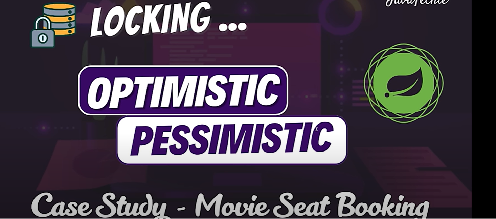

    Assume where multiple user trying to update same data at the same time. now, keeping your data 
    consistent during this situation is a tricky part. so, how to avoid this...

    That's what Spring Boot & Hibernate come to rescue to find something that is Optimistic &
    Pessimistic Locking mechanism.

    Using this strategies you can manage consurrency & ensure your data always keep safe & consistent
    & interesting thing is it all start with @Transactional annotation.

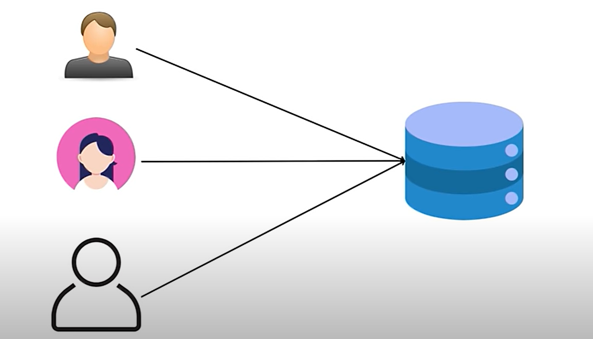

Usecase - Movie Seat Booking
----------------------------

    when multiple user trying to book a single ticket.

    How Cuncurrent seat booking to this particular database will be handled by 2 different strategies
    that is optimistic locking & pessimistic locking.

Optimistic Locking
================== 

    let's understand How optimistic locking mechanism handled the concurrent request to a database.
    
  Usecase Explanation & Handled by Optimistic Locking mechanism
  -------------------------------------------------------------

    In Optimistic locking mechanism how it work's It mentain a columns called version. initially a version
    is 0. let's assume there is 2 threads T1 & T2. 
    
    These 2 threads wants to book a movie ticket Titanic and there is only 1 ticket available. let's see how
    optimistic locking works or how concurrent request handled here. 

    so, to book a ticket First both the threads fetch the records from the DB. let's say first Thread 1 get a
    chance to update a ticket. so, once thread 1 booked the ticket the status will be changed to true and 
    the version number changed to 1. so thread 1 booked the ticket.
                                                                    now at the same time when Thread 2 trying 
    to book the same ticket what it observes. currently Thread have the copy of id-1, name-titanic, status-false, version-0
    now Thread 1 already booked the ticket or update the tickey so version number got changed to 1. so when Thread 2
    trying to update or book the ticket in version no. is 1 nut thread 2 read version no. as 0. 
            *** so, there is VERSION mISMATCH ***

    so, If there is a version mismatch found then immediately this optimistic locking will throw the Optimistic
    Locking Exception saying that another thread already updated/deleted the records or ongoing transaction is there
    so, you will not be able to book the ticket. so all the things is handled by the column called "VERSION".

   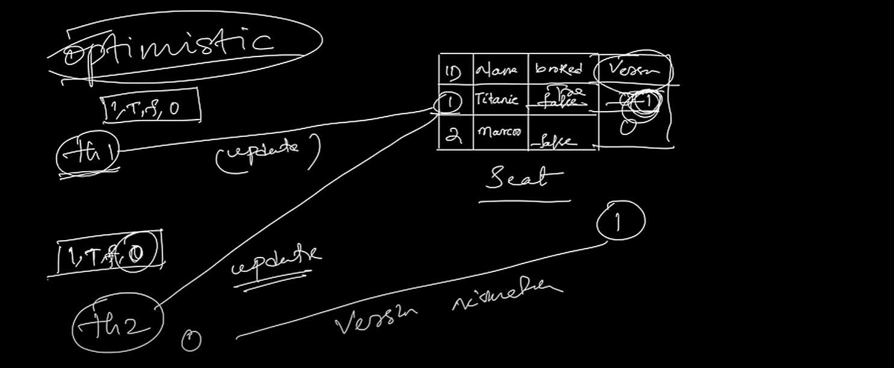

Pessimistic Locking
=================== 

  How Pessimistic Locking Mechanism works:

    Let's say there is a Thread 1 and Thread 2. now when Thread 1 trying to book the ticket or read/fetch the movie
    records at same time Thread 2 also trying to book. Now whoever get the first chance they will LOCK the Complete ROW 
                                                                                                  ---------------------
    The complete Row will be locked by Thread. let's say Thread 1 get 1st chance so, Thread 1 will Lock the complete Row
    untill and unless Thread 1 not release the lock Thread 2 can't book the Ticket again. In this way we can avoid completely 
    over booking issue. now once thread 1 booked the ticket the status will be changed to true now thread 1 released the lock
    and Thread 2 get the chance and while Thread 2 trying to book he find the status as a true which means already booked.
    It won't allowed you to book the ticket again. 

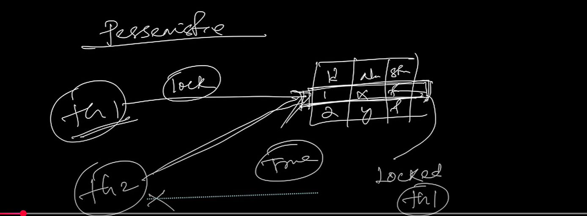

    so, The main Difference between Optimistic and Pessimistic is Optimistic not Lock the Table rather than it mentain a
    column called "VERSION" or version number. If there is any Version Mismatch, then It won't allowed to do any modification
    in the database.

    However this Pessimistic will apply the lock on db itself so that If there is any ongoing transaction then all other
    threads need to wait till the other transaction is completed. 

Demo Example & Demonstration (Code)    -  (Optimistic Locking)
--------------------------------------------------------------

  we will create multiple threads to simulate the exact flow.
  ** we need to see while 2 Threads trying to call the same method then how the locking mechanism will work and How version
      controlling will work here.
  ** if any of the thread will book the ticket or update the db then version value will be change and once another thread 
      will book or update the db the version no. should be match otw it should not allow, it will throw an exception.
  ** we must have to use @Transactional with our bookSeat() method to perform Optimistic locking.
  ** In our Entiry class we need to add one column version
       
       @Version
       private int version;

  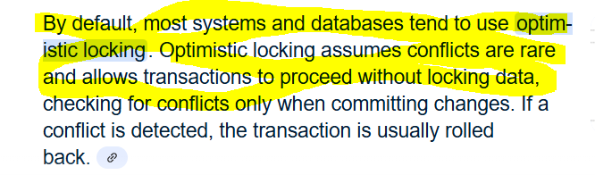

  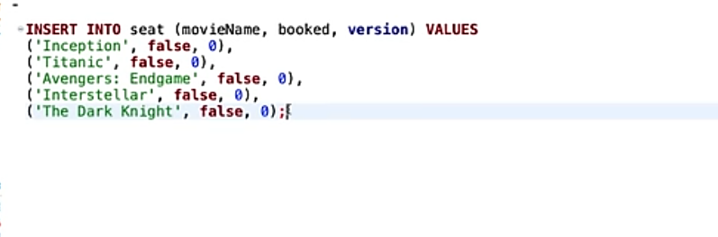

  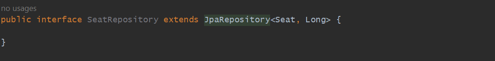

  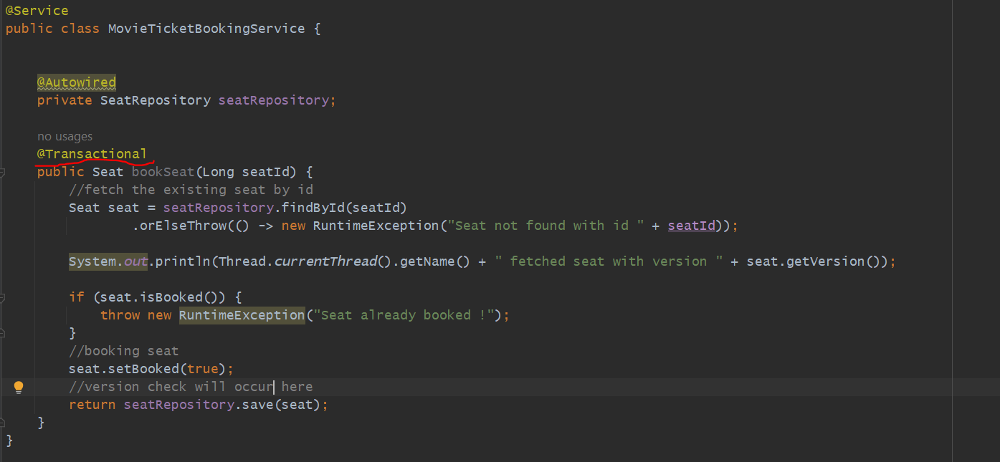

  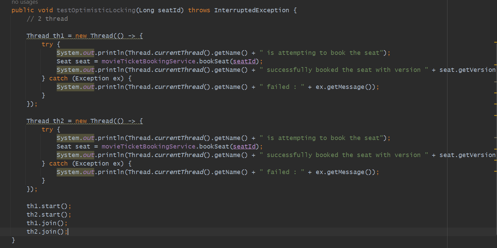

  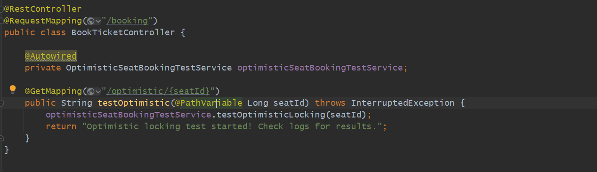

    Insert into seat (booked, movie_name, version) values (0, 'Inception', 0);
    Insert into seat (booked, movie_name, version) values (0, 'Titanic', 0);
    Insert into seat (booked, movie_name, version) values (0, 'Avengers', 0);
    Insert into seat (booked, movie_name, version) values (0, 'Intestaller', 0);
    Insert into seat (booked, movie_name, version) values (0, 'Dark Night', 0);

  http://localhost:8080/swagger-ui/index.html#

  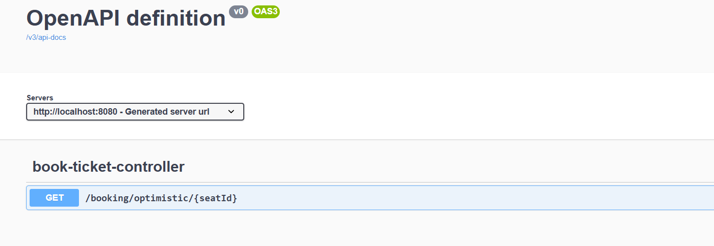

  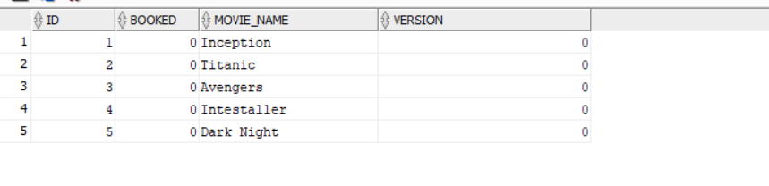

  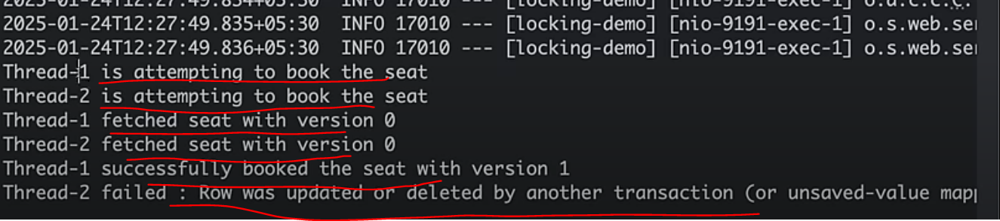
  
  
  

Pessimistic Locking
===================

    @Lock(LockModeType.PESSIMISTIC_WRITE)
    @Query("SELECT s FROM Seat s WHERE s.id= :seatId")
    Seat findByIdAndLock(Long seatId);

    What this Pessimistic Locking will do is It will apply the Lock on the table. so that If one Thread is doing something
    another thread must have to wait untill and unless 1st Thread is completing his task and release the lock.

    ** Rather than directly fetching By Id just Fetch By Id and Lock that Record. The Record you fetched by Id and Locked it. 
    
   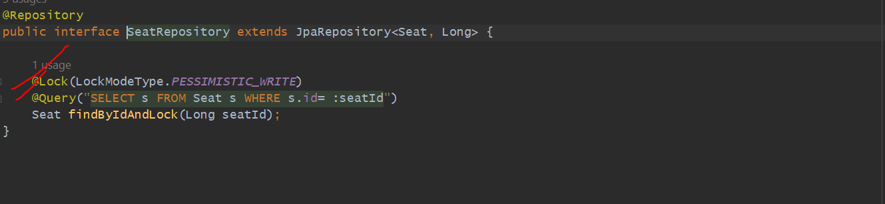

    ***findById is the field taht way JPA will work but you are trying to apply the Lock by your own for that particular entry 
    which u read By Id.

    *** you need to tell to the JPA / Hibernate that This particular method when i will findById I want to Lock the WRITE
    access. if thread 1 is writing something another thread like t2, t3, t4... must should wait in a queue.

    *** there is no concept of version in pessimistic so remove version things from common code.
    *** this Locking need to be in a Boundry of @Transactional.

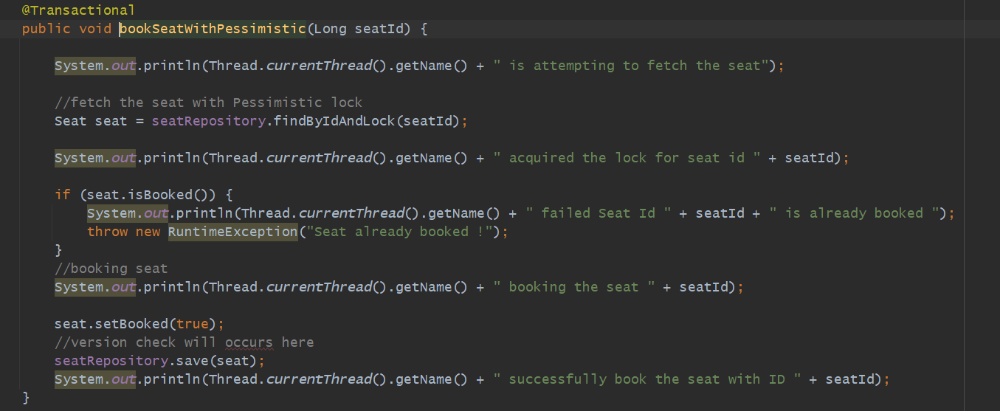

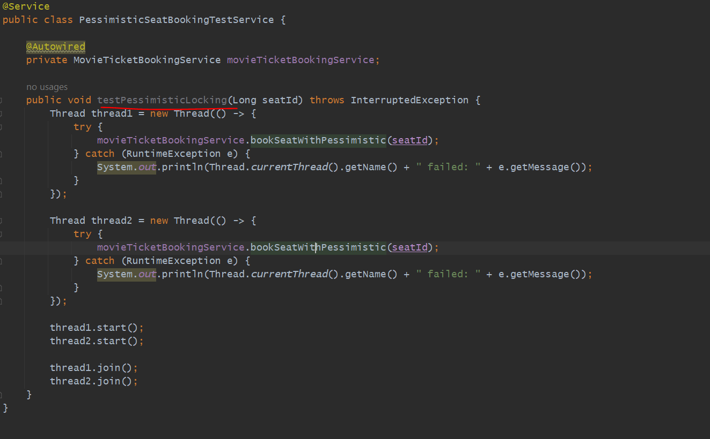

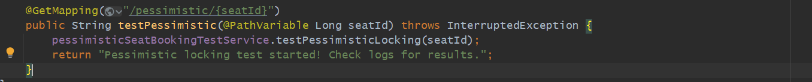

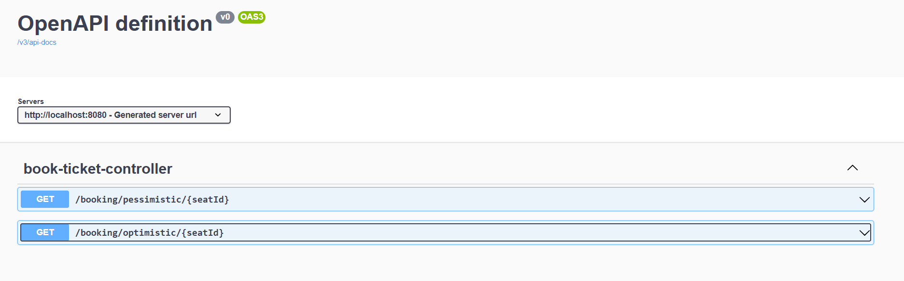

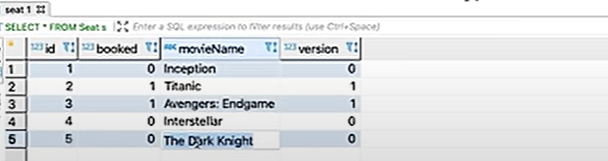

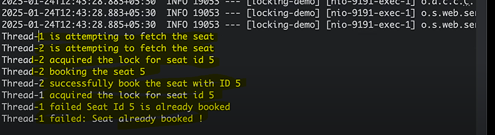

Diff between Pessimistic Lock & Hibernate Serializable Isolation Level
=======================================================================

    ** without @Transactional there is no use of using this Locking.
    ** Pessimistic Locking needs to be within a boundry of Transaction.
    ** Serializable also allow one after another similarly pessimistic also doing a same 
       But that on the Transaction Level Pessimistic Apply Lock on Database Level
                                                     --------------------------------

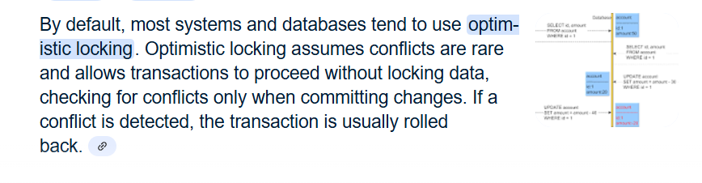

=============================================================
==================================================================

Database Locking
This project demonstrates two types of database locking mechanisms — Optimistic Locking and Pessimistic Locking — with a focus on booking seats for movies.

Insert Records to Seat Table
INSERT INTO seat (movieName, booked, version) VALUES
('Inception', false, 0),
('Titanic', false, 0),
('Avengers: Endgame', false, 0),
('Interstellar', false, 0),
('The Dark Knight', false, 0);
Optimistic Validation
cURL Command
curl -X 'GET' \
'http://localhost:9191/booking/optimistic/2' \
-H 'accept: */*'
Results
Thread-1 is attempting to book the seat optimistically...
Thread-1 fetched seat with version: 0
Thread-2 is attempting to book the seat optimistically...
Thread-2 fetched seat with version: 0
Thread-1 successfully booked the seat! and version is 1
Thread-2 failed: Row was updated or deleted by another transaction (or unsaved-value mapping was incorrect): [com.javatechie.entity.Seat#2]
Step-by-Step Breakdown
Thread-1 and Thread-2 Fetch the Same Seat (Version 0)
Both threads start their tasks:

Thread-1 fetches the Seat entity with version: 0.
Before Thread-1 completes its booking, Thread-2 also fetches the same Seat entity with version: 0.
This is expected behavior because optimistic locking allows multiple threads to read the same entity simultaneously. At this point:

Both threads hold a copy of the entity with version: 0.
Thread-1 Successfully Books the Seat

Thread-1 proceeds to update the seat:
It checks the version of the entity in the database (version: 0) and finds it matches the version it fetched.
The update is successful, and the version of the entity in the database is incremented to 1.
Thread-1 logs:
Thread-1 successfully booked the seat! and version is 1
Thread-2 Fails Due to Version Mismatch

After Thread-1 updates the seat, Thread-2 attempts to update the same seat using its fetched copy (version: 0).
Before updating, the database checks if the version in Thread-2's copy (version: 0) matches the current version in the database (version: 1).
The versions do not match because Thread-1 has already updated the seat.
As a result, Hibernate throws an OptimisticLockingFailureException, indicating that another transaction modified the row since Thread-2 fetched it.
Thread-2 logs:
Thread-2 failed: Row was updated or deleted by another transaction (or unsaved-value mapping was incorrect): [com.javatechie.entity.Seat#2]
Pessimistic Locking in Action: Seat Booking Example
cURL Command
curl -X 'GET' \
'http://localhost:9191/booking/optimistic/2' \
-H 'accept: */*'
Scenario
Two threads (Thread-1 and Thread-2) attempt to book the same seat (ID 2) using Pessimistic Locking. This locking mechanism ensures that only one thread can access and modify the seat at a time.

Results
Thread-1 is attempting to fetch the seat with a pessimistic lock...
Thread-2 is attempting to fetch the seat with a pessimistic lock...
Thread-1 acquired the lock for seat ID: 2
Thread-1 is booking the seat...
Thread-1 successfully booked the seat with ID: 2
Thread-2 acquired the lock for seat ID: 2
Thread-2 failed: Seat ID 2 is already booked!
Thread-2 failed: Seat already booked
Execution Flow and Logs
Thread-1 Attempts to Fetch the Seat

Thread-1 starts first and acquires the lock for the seat (ID 2).
Logs:
Thread-1 is attempting to fetch the seat with a pessimistic lock...
Thread-1 acquired the lock for seat ID: 2
Thread-2 Attempts to Fetch the Seat

While Thread-1 is holding the lock, Thread-2 starts and waits for the lock to be released.
Logs:
Thread-2 is attempting to fetch the seat with a pessimistic lock...
Thread-1 Books the Seat

Thread-1 successfully books the seat and releases the lock at the end of the transaction.
Logs:
Thread-1 is booking the seat...
Thread-1 successfully booked the seat with ID: 2
Thread-2 Acquires the Lock and Fails

After the lock is released, Thread-2 acquires the lock and checks the seat's status.
Since the seat is already booked, Thread-2 fails with an exception.
Logs:
Thread-2 acquired the lock for seat ID: 2
Thread-2 failed: Seat ID 2 is already booked!
Thread-2 failed: Seat already booked
Key Points
Exclusive Access:
Pessimistic Locking ensures that only one thread can modify the seat at a time by locking it in the database during the transaction.

Sequential Processing:
Threads attempting to access the same entity are processed one after the other, avoiding conflicts and ensuring data consistency.

Failure Handling:
If a thread finds the entity in an invalid state (e.g., already booked), it throws an exception to indicate the operation cannot proceed
