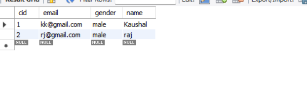
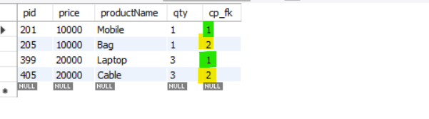
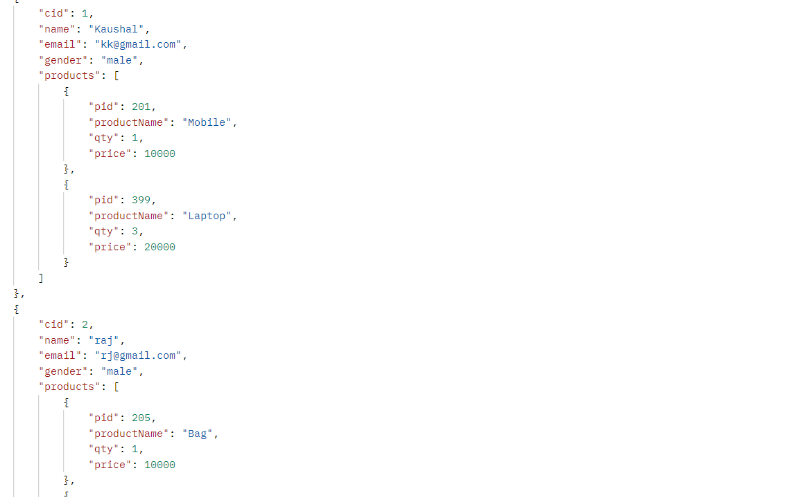

# One to Many : Testing

   # SpringBoot: Spring Data JPA - One to Many & Join Query

   

   # Uni-Directional

    we will discuss how to do Entity Relationship Mapping using Spring Data JPA and we will also discuss how to perform 
    JOIN operation using Spring data JPA.

    There is one customer deals with multiple products. Product-1, product-2 and product-3. 

    @Data
    @AllArgsConstructor
    @NoArgsConstructor
    @ToString
    @Entity
    public class Customer {
    @Id
    @GeneratedValue(strategy = GenerationType.IDENTITY)
    private int cid;
    private String name;
    private String email;
    private String gender;

    @OneToMany(targetEntity = Product.class, cascade = CascadeType.ALL)
    @JoinColumn(name = "cp_fk" , referencedColumnName = "cid")
    private List<Product> products;
    }

    @Data
    @AllArgsConstructor
    @NoArgsConstructor
    @ToString
    @Entity
    public class Product {
    @Id
    private int pid;
    private String productName;
    private int qty;
    private int price;
}

    @Data
    @AllArgsConstructor
    @NoArgsConstructor
    @ToString
    public class OrderRequest {
        private Customer customer;
    }

    @PostMapping("/placeOrder")
    public Customer placeOrder(@RequestBody OrderRequest orderRequest) {
        return customerRepository.save(orderRequest.getCustomer());
    }

    @GetMapping("/findAllOrders")
    public List<Customer> findAllOrders(){
        return customerRepository.findAll();
    }

 Postman: 
 
  POST - http://localhost:8080/placeOrder

    {
    "customer": {
        "name": "raj",
        "email": "rj@gmail.com",
        "gender": "male",
        "products": [
        {
            "pid": 205,
            "productName": "Bag",
            "price": 10000,
            "qty": 1
        },
        {
            "pid": 405,
            "productName": "Cable",
            "price": 20000,
            "qty": 3
        }]
    }
    }

  GET - http://localhost:8080/findAllOrders

    

# Join Query in Hibernate
   
    Now let’s do Join Operation to fetch couple of fields from Customer table and from Product table.

    So, from Customer table we will fetch Customer name and from Product table we will fetch Product name using JOIN Query. 
    Then just go to our Repository class and there we need to write our JOIN Query.

  https://hellokoding.com/jpa-one-to-many-relationship-mapping-example-with-spring-boot-maven-and-mysql/

  https://hellokoding.com/jpa-and-hibernate-one-to-many-unidirectional-spring-boot/

