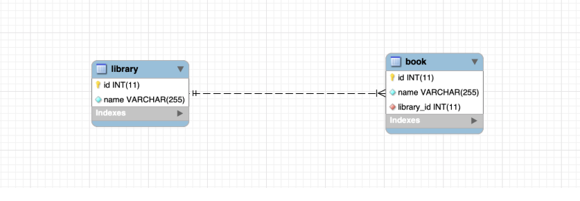

# The One to Many Relationship

One-to-many refers to the relationship between two tables A and B in which one row of A may be linked with many rows of B, 
but one row of B is linked to only one row of A

We will use the relationship between the library and books to implement for this example. 
One library may have many books, one book can only be managed by one library. 
The relationship is enforced via the library_id foreign key column placed on the book table (the Many side)

 

# The pros of @OneToMany
Let's test the one to many REST APIs with Postman

Thanks to the CascadeType.ALL setting with @OneToMany mapping on the parent entity

@OneToMany(mappedBy = "library", cascade = CascadeType.ALL)
private Set<Book> books = new HashSet<>();
You can cascade the CRUD operations on the parent to child collection by using a single line of code

# The cons of @OneToMany
Everything is a tradeoff, and indeed the @OneToMany sugar syntax comes with performance issues

1) It is not possible to limit the size of the @OneToMany collection directly from the database. So all the APIs that retrieving the @OneToMany collection may hit a performance issue when the collection size grows

2) Using CascadeType.ALL and CascadeType.REMOVE with @OneToMany can cause a performance issue

The above Delete API works fine on the surface, but if look into the console log, we would see the following

-------
Hibernate: select library0_.id as id1_1_0_, library0_.name as name2_1_0_ from library library0_ where library0_.id=?  
Hibernate: select books0_.library_id as library_3_0_0_, books0_.id as id1_0_0_, books0_.id as id1_0_1_, books0_.library_id as library_3_0_1_, books0_.name as name2_0_1_ from book books0_ where books0_.library_id=?  
Hibernate: delete from book where id=?  
Hibernate: delete from book where id=?  
Hibernate: delete from library where id=?
To do the REMOVE cascading operations, Hibernate has to generate 1 SQL to get all child entities and N+1 DELETE queries. Obviously, to delete the child collection, we only need 1 DELETE query and we don't have to fetch the entire collection

# A compromise approach for @OneToMany
We can fix the performance issues of @OneToMany, but have to trade the convenient cascading and navigating operations

1) Update @OneToMany settings to use cascade = {CascadeType.PERSIST,CascadeType.MERGE} instead of CascadeType.ALL, and remove the getChildCollection() method from the parent entity

 - Restart the application and test the Delete Lirary API with Postman again you would see that to delete the child collection, Hibernate only generates 1 DELETE query

Hibernate: delete from book where library_id=?
As we remove the getBooks() method from the Library entity, the create, update, and getById APIs won't return the list books anymore but we can fetch it via the getByLibraryId API or if you would like to include it in the response of those APIs, consider to use the DTO design pattern like the suggestion in the later part

# When to use @OneToMany
In summary, you can use @OneToMany if the child collection size is limited, otherwise, if the child collection can grow to a lot of items, consider to

Don't retrieve @OneToMany child collection directly from the parent, you can retrieve via custom queries on the repositories like the step 2 above

Don't use CascadeType.REMOVE or CascadeType.ALL with @OneToMany

# Unidirectional mapping with the only @ManyToOne
You can use the only @ManyToOne to do the mapping for the One to Many unidirectional relationship. You may have to do more with the only @ManyToOne but it can help you worry less about the potential issues of @OneToMany

Convert JPA and Hibernate entities to DTO objects
In practice, one JPA and Hibernate entity model can not fit the various needs of clients. So instead of exposing directly, you may like converting JPA and Hibernate entities to DTO objects for providing custom API response data to the client

# Conclusion
In this tutorial, we learned about bidirectional mapping the One-To-Many relationship with @OneToMany and @ManyToOne and expose it through REST APIs in Spring Boot and Spring Data JPA to do CRUD operations against a MySQL database. We also had a look at the pros and cons of using @OneToMany. The source code is available on Github

